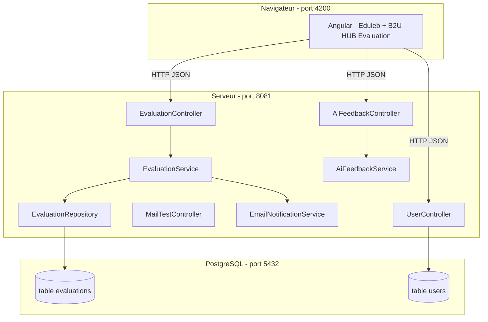
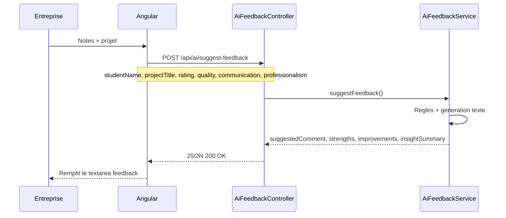

# Documentation complète — Projet B2U-HUB / PI

Document de référence pour comprendre **tout le projet** : technologies, lien **Frontend ↔ Backend ↔ Base de données**, **IA**, **e-mail**, et **glossaire des mots-clés**.

---

## Table des matières

1. [Résumé en une page](#1-résumé-en-une-page)
2. [Technologies utilisées](#2-technologies-utilisées)
3. [Architecture globale](#3-architecture-globale)
4. [Lien Frontend → Backend → PostgreSQL](#4-lien-frontend--backend--postgresql)
5. [Intelligence artificielle (IA) — ce qu’on a vraiment utilisé](#5-intelligence-artificielle-ia--ce-quon-a-vraiment-utilisé)
6. [Notification e-mail à l’étudiant](#6-notification-e-mail-à-létudiant)
7. [API REST — liste des endpoints](#7-api-rest--liste-des-endpoints)
8. [Structure des fichiers importants](#8-structure-des-fichiers-importants)
9. [Glossaire — tous les mots-clés du projet](#9-glossaire--tous-les-mots-clés-du-projet)
10. [Démarrer le projet](#10-démarrer-le-projet)
11. [Phrase pour la soutenance / validation](#11-phrase-pour-la-soutenance--validation)

---

## 1. Résumé en une page

| Couche | Outil | Port | Rôle |
|--------|-------|------|------|
| **Interface** | Angular 18 | 4200 | Pages web (thème Eduleb + module B2U-HUB) |
| **Serveur API** | Spring Boot 4 + Java 17 | 8081 | Logique métier, IA, e-mails, accès base |
| **Base de données** | PostgreSQL | 5432 | Tables `evaluations`, `users`, etc. |

**Parcours utilisateur (entreprise) :**

1. Choisir un projet et des notes (étoiles).
2. Cliquer **Générer le feedback avec l’IA** → le backend analyse les critères et propose un texte.
3. Cliquer **Publier** → l’évaluation est **sauvegardée** en PostgreSQL et un **e-mail** est envoyé à l’étudiant (si Gmail configuré).

---

## 2. Technologies utilisées

### Frontend

| Technologie | Rôle dans notre projet |
|-------------|------------------------|
| **Angular 18** | Framework SPA (Single Page Application) |
| **TypeScript** | Langage du frontend |
| **HttpClient** | Appels HTTP vers le backend |
| **Reactive Forms** | Formulaire d’évaluation |
| **Signals** | État réactif (`noteGlobale`, `aiResult`, etc.) |
| **Standalone Components** | Composants sans NgModule |
| **Thème Eduleb** | Maquette HTML/CSS intégrée (pages vitrine) |

### Backend

| Technologie | Rôle dans notre projet |
|-------------|------------------------|
| **Spring Boot 4** | Framework serveur Java |
| **Spring Web MVC** | API REST (`@RestController`) |
| **Spring Data JPA** | Accès base via entités et repositories |
| **Hibernate** | ORM (mapping tables ↔ classes Java) |
| **Lombok** | Réduit le code boilerplate (`@Data`, `@Builder`) |
| **Spring Mail** | Envoi d’e-mails SMTP (Gmail) |
| **Spring Security** | Sécurité (ici : tout ouvert en dev) |

### Base de données & outils

| Technologie | Rôle |
|-------------|------|
| **PostgreSQL** | Base relationnelle `b2u_hub` |
| **pgAdmin** | Interface graphique pour voir les tables |
| **Postman** | Tests des API sans interface |
| **Maven** (`mvnw`) | Compilation et lancement du backend |
| **npm** | Dépendances et serveur Angular |

---

## 3. Architecture globale



**Règle importante :** Angular **ne se connecte jamais** directement à PostgreSQL. Tout passe par Spring Boot.

---

## 4. Lien Frontend → Backend → PostgreSQL

### 4.1 Schéma du flux complet

```
[1] Utilisateur sur Angular (localhost:4200)
         │
         ▼
[2] EvaluationApiService.ts  (HttpClient)
         │  URL : environment.apiUrl + "/api/..."
         │  Exemple : http://localhost:8081/api/evaluations
         ▼
[3] Controller Java (@RestController)
         │  Exemple : EvaluationController.java
         ▼
[4] Service Java (logique métier)
         │  Exemple : EvaluationService.java
         ▼
[5] Repository JPA
         │  Exemple : EvaluationRepository.java
         ▼
[6] PostgreSQL (table evaluations)
```

### 4.2 Fichier de liaison côté Angular

**`frontend/src/environments/environment.ts`**

```typescript
export const environment = {
  apiUrl: 'http://localhost:8081',
};
```

**`frontend/src/app/b2u-hub/evaluation/evaluation-api.service.ts`**

- `listEvaluations()` → `GET /api/evaluations`
- `createEvaluation()` → `POST /api/evaluations`
- `suggestFeedback()` → `POST /api/ai/suggest-feedback`

**`frontend/src/app/app.config.ts`** — active `provideHttpClient()` pour que les services puissent appeler l’API.

### 4.3 CORS — pourquoi c’est nécessaire

- Frontend : `http://localhost:4200`
- Backend : `http://localhost:8081`

Ce sont **deux origines** différentes. Le navigateur bloque par défaut les appels croisés.

**Solution dans le projet :**

- `WebConfig.java` → autorise `/api/**`
- `@CrossOrigin("*")` sur les controllers

### 4.4 Correspondance des champs JSON

| Angular (TypeScript) | Java (Evaluation) | Colonne PostgreSQL |
|---------------------|-------------------|-------------------|
| `studentName` | `studentName` | `student_name` |
| `studentEmail` | `studentEmail` | `student_email` |
| `enterpriseName` | `enterpriseName` | `enterprise_name` |
| `projectTitle` | `projectTitle` | `project_title` |
| `rating` | `rating` | `rating` |
| `comment` | `comment` | `comment` |
| `projectDate` | `projectDate` | `project_date` |

Format date : `"2026-05-21"` (chaîne ISO).

### 4.5 Exemple pas à pas : publier une évaluation

| Étape | Où | Quoi |
|-------|-----|------|
| 1 | `company-new-evaluation.component.ts` | L’utilisateur remplit le formulaire |
| 2 | `evaluation-api.service.ts` | `POST` vers `/api/evaluations` avec JSON |
| 3 | `EvaluationController.java` | Reçoit le JSON, appelle le service |
| 4 | `EvaluationService.java` | Valide, sauvegarde, envoie l’e-mail |
| 5 | `EvaluationRepository.java` | `save()` → INSERT en base |
| 6 | `EmailNotificationService.java` | Envoi SMTP à `studentEmail` |
| 7 | Réponse JSON | `{ evaluation, emailSent, emailMessage }` |
| 8 | Angular | Redirection + message sur le tableau de bord |

### 4.6 JPA / Hibernate — lien Backend ↔ Base

| Concept | Fichier | Explication |
|---------|---------|-------------|
| **Entity** | `Evaluation.java` | Classe Java = une table |
| **@Entity** | sur la classe | « Cette classe est une table » |
| **@Table(name = "evaluations")** | | Nom de la table en base |
| **Repository** | `EvaluationRepository.java` | Interface pour `findAll()`, `save()`, etc. |
| **ddl-auto=update** | `application.properties` | Hibernate crée/met à jour les colonnes automatiquement |

**Connexion base** (`application.properties`) :

```properties
spring.datasource.url=jdbc:postgresql://localhost:5432/b2u_hub
spring.datasource.username=postgres
spring.datasource.password=0000
```

---

## 5. Intelligence artificielle (IA) — ce qu’on a vraiment utilisé

### 5.1 Type d’IA dans ce projet

Nous n’avons **pas** branché OpenAI, ChatGPT ou Gemini avec une clé API payante.

Nous avons implémenté un **assistant IA hybride** côté backend :

| Composant | Description |
|-----------|-------------|
| **Analyse par règles** | Si `quality >= 4` → ajouter un point fort ; si `communication <= 2` → axe d’amélioration, etc. |
| **Génération de texte** | Assemblage d’un paragraphe professionnel (`suggestedComment`) |
| **Scoring / insight** | `insightSummary`, `confidenceScore` pour le futur scoring B2U-HUB |

**Fichier principal :** `AiFeedbackService.java`  
**API exposée :** `POST /api/ai/suggest-feedback`  
**Controller :** `AiFeedbackController.java`

### 5.2 Pourquoi ce choix ?

- Démo **fiable** à la soutenance (pas de panne réseau / clé API).
- Même **contrat API** qu’un vrai LLM : on pourrait remplacer le corps de `AiFeedbackService` par un appel OpenAI plus tard **sans changer Angular**.

### 5.3 Flux IA (Frontend → Backend)



### 5.4 Entrée / sortie de l’API IA

**Entrée (`AiFeedbackRequest`) :**

```json
{
  "studentName": "Chahine Sassi",
  "projectTitle": "Plateforme B2U-HUB",
  "rating": 5,
  "quality": 5,
  "communication": 4,
  "professionalism": 5
}
```

**Sortie (`AiFeedbackResponse`) :**

| Champ | Signification |
|-------|---------------|
| `suggestedComment` | Texte de feedback prêt à publier |
| `strengths` | Liste des points forts |
| `improvements` | Liste des axes d’amélioration |
| `insightSummary` | Synthèse pour le scoring |
| `confidenceScore` | Score de confiance (ex. 0.94) |
| `modelLabel` | Nom affiché du moteur |

### 5.5 Fichiers IA côté frontend

| Fichier | Rôle |
|---------|------|
| `evaluation-api.service.ts` | Appel `suggestFeedback()` |
| `company-new-evaluation.component.ts` | Bouton « Générer avec l’IA » |
| `ai-feedback-fallback.ts` | Repli local si le backend est down |

---

## 6. Notification e-mail à l’étudiant

Quand l’entreprise publie une évaluation :

1. Sauvegarde en base (`EvaluationService.create()`).
2. `EmailNotificationService.sendEvaluationToStudent()` envoie un e-mail à `studentEmail`.

| Fichier | Rôle |
|---------|------|
| `EmailNotificationService.java` | Construit et envoie le mail |
| `MailConfig.java` | Configuration SMTP Gmail |
| `application-local.properties` | Mot de passe d’application Google (secret, non versionné) |
| `MailTestController.java` | `POST /api/mail/test` pour tester sans évaluation |

**Guide détaillé :** `CONFIGURATION-EMAIL.md`

Par défaut `app.mail.enabled=false` → pas d’e-mail réel tant que Gmail n’est pas configuré.

---

## 7. API REST — liste des endpoints

| Méthode | URL | Rôle |
|---------|-----|------|
| `POST` | `/api/users/register` | Créer un utilisateur (ex. étudiant Chahine Sassi) |
| `GET` | `/api/users` | Liste des utilisateurs |
| `POST` | `/api/ai/suggest-feedback` | **IA** — générer le feedback |
| `GET` | `/api/evaluations` | Liste des évaluations |
| `POST` | `/api/evaluations` | Créer évaluation + e-mail |
| `GET` | `/api/evaluations/{id}` | Détail |
| `PUT` | `/api/evaluations/{id}` | Modifier |
| `DELETE` | `/api/evaluations/{id}` | Supprimer |
| `POST` | `/api/mail/test` | Tester l’e-mail |

**Base :** `http://localhost:8081`  
**Collection Postman :** `postman/evaluations-crud.postman_collection.json`

---

## 8. Structure des fichiers importants

### Backend (`src/main/java/com/example/pi/`)

| Fichier | Mot-clé | Rôle |
|---------|---------|------|
| `PiApplication.java` | `@SpringBootApplication` | Point d’entrée du serveur |
| `Evaluation.java` | `@Entity` | Table evaluations |
| `User.java` | `@Entity` | Table users |
| `EvaluationRepository.java` | `JpaRepository` | Accès données evaluations |
| `EvaluationController.java` | `@RestController` | API CRUD evaluations |
| `EvaluationService.java` | `@Service` | Validation + save + e-mail |
| `AiFeedbackController.java` | `@RestController` | API IA |
| `AiFeedbackService.java` | `@Service` | Moteur IA (règles + texte) |
| `AiFeedbackRequest.java` | `DTO` | Données entrée IA |
| `AiFeedbackResponse.java` | `DTO` | Données sortie IA |
| `EmailNotificationService.java` | `@Service` | Envoi e-mail |
| `SecurityConfig.java` | `SecurityFilterChain` | Sécurité (permitAll en dev) |
| `WebConfig.java` | `CORS` | Autorise Angular → API |

### Frontend (`frontend/src/app/`)

| Fichier | Rôle |
|---------|------|
| `app.routes.ts` | Routes principales |
| `eduleb/eduleb.routes.ts` | Pages Eduleb + lien vers evaluation |
| `b2u-hub/evaluation/evaluation.routes.ts` | Routes `/evaluation/entreprise`, etc. |
| `evaluation-api.service.ts` | **Pont HTTP** vers le backend |
| `evaluation-mock.service.ts` | Données fictives (projets, maquette) |
| `company-new-evaluation.component.*` | Formulaire + IA + publier |
| `company-dashboard.component.*` | Historique depuis l’API |

### Configuration

| Fichier | Rôle |
|---------|------|
| `application.properties` | PostgreSQL, port 8081, import mail local |
| `application-local.properties` | Identifiants Gmail (à remplir par vous) |
| `environment.ts` | URL API pour Angular |

---

## 9. Glossaire — tous les mots-clés du projet

### A

| Mot | Signification dans notre projet |
|-----|--------------------------------|
| **Angular** | Framework frontend qui affiche les pages dans le navigateur |
| **API** | Interface du backend accessible par URL (`/api/...`) |
| **API REST** | API qui utilise HTTP (GET, POST, PUT, DELETE) et JSON |
| **Assistant IA** | Fonction qui aide à rédiger le feedback à partir des notes |

### B

| Mot | Signification |
|-----|---------------|
| **Backend** | Partie serveur Java (Spring Boot), port 8081 |
| **B2U-HUB** | Nom de la plateforme métier (freelances / entreprises) |
| **Body (Postman)** | Corps JSON envoyé avec une requête POST |

### C

| Mot | Signification |
|-----|---------------|
| **Component** | Composant Angular (page ou morceau d’interface) |
| **Controller** | Classe Java qui reçoit les requêtes HTTP (`@RestController`) |
| **CORS** | Mécanisme navigateur ; configuré pour autoriser 4200 → 8081 |
| **CRUD** | Create, Read, Update, Delete (créer, lire, modifier, supprimer) |
| **Critères** | quality, communication, professionalism (notes 1 à 5) |

### D

| Mot | Signification |
|-----|---------------|
| **DTO** | Data Transfer Object — objet pour échanger des données API (ex. `AiFeedbackRequest`) |
| **ddl-auto=update** | Hibernate met à jour le schéma de la base automatiquement |

### E

| Mot | Signification |
|-----|---------------|
| **Entity** | Classe Java liée à une table SQL (`@Entity`) |
| **Évaluation** | Note + commentaire qu’une entreprise donne à un étudiant après un projet |
| **Eduleb** | Thème HTML du site (vitrine) intégré dans Angular |

### F

| Mot | Signification |
|-----|---------------|
| **Feedback** | Commentaire écrit sur la performance de l’étudiant |
| **Frontend** | Partie Angular visible par l’utilisateur, port 4200 |
| **Freelance / Étudiant** | Profil évalué (ex. Chahine Sassi) |

### H

| Mot | Signification |
|-----|---------------|
| **Hibernate** | ORM utilisé par JPA pour parler à PostgreSQL |
| **HttpClient** | Service Angular pour appeler le backend |
| **Hybride (IA)** | IA par règles + génération de texte, sans API OpenAI externe |

### I

| Mot | Signification |
|-----|---------------|
| **IA / AI** | Ici : analyse des notes et proposition de texte (`AiFeedbackService`) |
| **Insight** | Résumé analytique (`insightSummary`) pour le scoring |
| **IntelliJ** | IDE pour lancer le backend Java |

### J

| Mot | Signification |
|-----|---------------|
| **JPA** | Java Persistence API — standard pour accéder à la base avec des objets |
| **JSON** | Format des données échangées `{ "studentName": "..." }` |

### L

| Mot | Signification |
|-----|---------------|
| **LLM** | Large Language Model (ChatGPT, etc.) — **non utilisé** dans la version actuelle, mais évolutif |
| **Lombok** | Bibliothèque qui génère getters/setters (`@Data`) |

### M

| Mot | Signification |
|-----|---------------|
| **Maquette** | Données fictives dans `evaluation-mock.service.ts` |
| **Maven** | Outil de build Java (`mvnw spring-boot:run`) |
| **MVC** | Model-View-Controller — pattern de Spring Web |

### O

| Mot | Signification |
|-----|---------------|
| **ORM** | Object-Relational Mapping — lier classes Java et tables SQL |

### P

| Mot | Signification |
|-----|---------------|
| **PostgreSQL** | Base de données relationnelle |
| **Postman** | Outil pour tester les API |
| **Port 4200** | Port du serveur de développement Angular |
| **Port 8081** | Port du serveur Spring Boot |
| **Proxy** | Redirection `/api` → backend (optionnel ; nous utilisons `apiUrl` direct) |

### R

| Mot | Signification |
|-----|---------------|
| **Rating** | Note globale de 1 à 5 |
| **Repository** | Interface d’accès base (`EvaluationRepository`) |
| **REST** | Style d’API basé sur HTTP + ressources (`/api/evaluations`) |
| **Role** | Rôle utilisateur : `STUDENT`, `COMPANY`, `ADMIN` |

### S

| Mot | Signification |
|-----|---------------|
| **Service** | Classe métier Java (`@Service`) — logique entre controller et base |
| **Signal** | Variable réactive Angular (`signal(0)`) |
| **SMTP** | Protocole d’envoi d’e-mails (Gmail) |
| **Spring Boot** | Framework qui démarre le serveur et configure tout |
| **Standalone** | Composant Angular autonome (sans module NgModule) |
| **StudentName / studentEmail** | Nom et e-mail de l’étudiant évalué |

### T

| Mot | Signification |
|-----|---------------|
| **TypeScript** | Langage du frontend (JavaScript typé) |

### U

| Mot | Signification |
|-----|---------------|
| **URL** | Adresse de l’API (ex. `http://localhost:8081/api/evaluations`) |
| **User** | Utilisateur enregistré (table `users`) |

---

## 10. Démarrer le projet

### Terminal 1 — Backend

```powershell
cd PI
.\mvnw.cmd spring-boot:run
```

Attendre : `Started PiApplication` — port **8081**.

### Terminal 2 — Frontend

```powershell
cd PI\frontend
npm start
```

Ouvrir : http://localhost:4200/evaluation/entreprise

### Prérequis

- Java **17** (JDK)
- Node.js **18+**
- PostgreSQL démarré, base **`b2u_hub`** créée

### Pages utiles

| URL | Page |
|-----|------|
| `/evaluation/entreprise` | Historique entreprise |
| `/evaluation/entreprise/nouvelle` | Formulaire + IA |
| `/evaluation/etudiant` | Espace étudiant (maquette) |

---

## 11. Phrase pour la soutenance / validation

> « Notre plateforme B2U-HUB repose sur une architecture **Angular + Spring Boot + PostgreSQL**. Le frontend communique avec le backend via des **API REST** en JSON. Le module **Évaluation & Feedback** intègre un **assistant IA** qui analyse les critères (qualité, communication, professionnalisme) et génère un feedback structuré. Les évaluations sont **persistées** en base, et l’étudiant reçoit une **notification par e-mail**. L’IA est implémentée en **moteur hybride** évolutif vers un LLM externe en production. »

---

## Documents complémentaires

| Fichier | Contenu |
|---------|---------|
| `CONFIGURATION-EMAIL.md` | Activer Gmail pour les vrais e-mails |
| `VALIDATION-IA.md` | Script court démo IA |
| `postman/evaluations-crud.postman_collection.json` | Tests API (Chahine Sassi, IA, e-mail) |

---

*Projet PI — Module B2U-HUB Évaluation & Feedback — Documentation mise à jour.*
