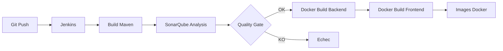

# DevOps — Pipeline Jenkins + SonarQube + Docker Build

Guide complet pour **Windows 10/11** avec **Docker Desktop**.

---

## Architecture du pipeline



| Étape | Outil | Résultat |
|-------|-------|----------|
| 1. Checkout | Jenkins | Code source |
| 2. Build & Test | Maven (`mvnw`) | JAR compilé |
| 3. Analyse qualité | SonarQube | Rapport bugs/code smells |
| 4. Quality Gate | SonarQube | Bloque si qualité insuffisante |
| 5. Docker Build | Docker Desktop | Images `b2u-hub-backend` + `b2u-hub-frontend` |

---

## Prérequis (Windows)

| Outil | Version | Vérification |
|-------|---------|--------------|
| Docker Desktop | 4.x+ | `docker --version` |
| Git | 2.x+ | `git --version` |
| Java 17 | JDK 17 | `java -version` (optionnel si tout passe par Docker) |
| 8 Go RAM min | — | SonarQube seul utilise ~2 Go |

**Docker Desktop** : activer **WSL 2 backend** (Settings → General).

---

## Étape 1 — Démarrer Jenkins + SonarQube

### Commande (PowerShell)

```powershell
cd "C:\Users\USER\Downloads\Nouveau dossier\PI\PI\devops"
.\start-devops.ps1
```

Ou manuellement :

```powershell
cd "C:\Users\USER\Downloads\Nouveau dossier\PI\PI\devops"
docker compose -f docker-compose.devops.yml up -d --build
```

### Vérifier que les conteneurs tournent

```powershell
docker ps
```

Vous devez voir :
- `b2u-jenkins` → port **8080**
- `b2u-sonarqube` → port **9000**
- `b2u-sonar-db` → PostgreSQL interne

### URLs

| Service | URL | Identifiants par défaut |
|---------|-----|------------------------|
| **Jenkins** | http://localhost:8080 | Mot de passe initial (voir ci-dessous) |
| **SonarQube** | http://localhost:9000 | `admin` / `admin` (changer au 1er login) |

### Mot de passe initial Jenkins

```powershell
docker exec b2u-jenkins cat /var/jenkins_home/secrets/initialAdminPassword
```

---

## Étape 2 — Configurer SonarQube

1. Ouvrir http://localhost:9000
2. Login : `admin` / `admin` → changer le mot de passe
3. **Projects → Create project → Manually**
   - Project key : `b2u-hub`
   - Display name : `B2U-HUB PI`
4. **My Account → Security → Generate Token**
   - Nom : `jenkins`
   - Copier le token (ex: `squ_xxxxxxxx`)

### Test SonarQube en local (sans Jenkins)

```powershell
cd "C:\Users\USER\Downloads\Nouveau dossier\PI\PI"
$env:JAVA_HOME = "C:\Users\USER\.jdks\jbr-17.0.9"
.\mvnw.cmd clean verify sonar:sonar `
  -Dsonar.projectKey=b2u-hub `
  -Dsonar.host.url=http://localhost:9000 `
  -Dsonar.token=VOTRE_TOKEN_SONAR
```

---

## Étape 3 — Configurer Jenkins

### 3.1 Premier démarrage Jenkins

1. http://localhost:8080
2. Coller le mot de passe initial
3. **Install suggested plugins**
4. Créer un utilisateur admin

### 3.2 Plugins requis

**Manage Jenkins → Plugins → Available**

Installer si absent :
- **SonarQube Scanner**
- **Pipeline**
- **Git**
- **Docker Pipeline** (optionnel)
- **GitHub** (si repo GitHub)

Redémarrer Jenkins après installation.

### 3.3 Configurer SonarQube dans Jenkins

**Manage Jenkins → System → SonarQube servers**

| Champ | Valeur |
|-------|--------|
| Name | `SonarQube` |
| Server URL | `http://sonarqube:9000` (Jenkins dans Docker) |
| Server authentication token | Token `squ_...` créé sur SonarQube |

> Si Jenkins est installé **nativement sur Windows** (pas Docker), URL = `http://localhost:9000`

**Manage Jenkins → Credentials → Add**

- Kind : Secret text
- Secret : token SonarQube `squ_...`
- ID : `sonar-token`

### 3.4 Configurer le webhook Quality Gate (optionnel)

**SonarQube → Administration → Webhooks → Create**

| Champ | Valeur |
|-------|--------|
| Name | `jenkins` |
| URL | `http://jenkins:8080/sonarqube-webhook/` |

---

## Étape 4 — Créer le job Pipeline Jenkins

1. **New Item → Pipeline** → nom : `b2u-hub-pipeline`
2. **Pipeline → Definition** : Pipeline script from SCM
3. **SCM** : Git
4. **Repository URL** : URL de votre repo GitHub
5. **Branch** : `*/main`
6. **Script Path** : `Jenkinsfile` (Jenkins dans Docker) ou `Jenkinsfile.windows` (Jenkins natif Windows)

### Alternative : Pipeline depuis le Jenkinsfile local

Si pas encore sur GitHub, **Pipeline script** → coller le contenu de `Jenkinsfile`.

---

## Étape 5 — Tester Docker Build manuellement (Windows)

### Backend

```powershell
cd "C:\Users\USER\Downloads\Nouveau dossier\PI\PI"
docker build -f Dockerfile.backend -t b2u-hub-backend:latest .
```

### Frontend

```powershell
cd "C:\Users\USER\Downloads\Nouveau dossier\PI\PI\frontend"
docker build -f Dockerfile -t b2u-hub-frontend:latest .
```

### Vérifier les images

```powershell
docker images | Select-String "b2u-hub"
```

### Lancer le backend en conteneur

```powershell
docker run --rm -p 8081:8081 `
  -e SPRING_DATASOURCE_URL=jdbc:postgresql://host.docker.internal:5432/b2u_hub `
  -e SPRING_DATASOURCE_USERNAME=postgres `
  -e SPRING_DATASOURCE_PASSWORD=0000 `
  b2u-hub-backend:latest
```

### Lancer le frontend en conteneur

```powershell
docker run --rm -p 4200:80 b2u-hub-frontend:latest
```

→ Frontend : http://localhost:4200

---

## Fichiers DevOps du projet

| Fichier | Rôle |
|---------|------|
| `Jenkinsfile` | Pipeline pour Jenkins (Linux/Docker) |
| `Jenkinsfile.windows` | Pipeline pour Jenkins natif Windows |
| `Dockerfile.backend` | Image Spring Boot |
| `frontend/Dockerfile` | Image Angular + Nginx |
| `sonar-project.properties` | Config analyse SonarQube |
| `devops/docker-compose.devops.yml` | Stack Jenkins + SonarQube |
| `devops/start-devops.ps1` | Script démarrage Windows |

---

## Commandes utiles

### Arrêter la stack DevOps

```powershell
cd devops
docker compose -f docker-compose.devops.yml down
```

### Voir les logs

```powershell
docker logs b2u-jenkins -f
docker logs b2u-sonarqube -f
```

### Relancer un build Jenkins manuellement

Jenkins → `b2u-hub-pipeline` → **Build Now**

### Supprimer les images Docker

```powershell
docker rmi b2u-hub-backend:latest b2u-hub-frontend:latest
```

---

## Dépannage Windows

| Problème | Solution |
|----------|----------|
| `docker.sock` permission denied | Redémarrer Docker Desktop, relancer `docker compose up` |
| SonarQube ne démarre pas | Attendre 2-3 min, vérifier RAM (min 8 Go) |
| Jenkins ne build pas Docker | Vérifier montage `/var/run/docker.sock` dans compose |
| `sonar:sonar` 401 | Token SonarQube invalide ou expiré |
| `gemini` / secrets dans build | `.dockerignore` exclut `application-local.properties` |
| Maven Java 22 vs 17 | Utiliser `mvnw` et `JAVA_HOME` JDK 17 |

---

## Phrase pour la soutenance PFE

> « Notre chaîne DevOps intègre un pipeline Jenkins automatisé qui compile le backend Spring Boot, exécute l'analyse de qualité SonarQube avec quality gate, puis construit les images Docker du backend et du frontend Angular. L'infrastructure CI/CD tourne localement via Docker Desktop sur Windows. »

---

## Schéma des ports

| Service | Port |
|---------|------|
| Jenkins | 8080 |
| SonarQube | 9000 |
| Backend (local) | 8081 |
| Frontend (local) | 4200 |
| PostgreSQL app | 5432 |
